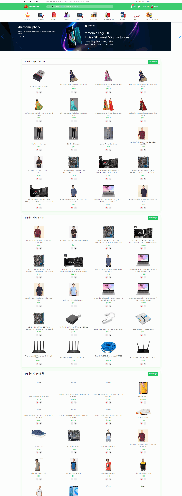

# Dream Bazar Multi-Product Ecommerce Application 

Dream Bazar is Multi-Product and Vendor Ecommerce website, build with Nodejs, React js and Mongodb

Project Directory
- client [client side]
- client/public/static [static directory for development mode]`

### This Application under development

Live Link [upcoming preview]()

## Application Features
- Multiple language system ( currently bangla and english)
- Dark and light mode system.
- Social Facebook, Google and Password based Authentication using passport and jwt.
- Reset password via sending email using nodemailer
- Multiple Category system
- Multiple vendor system. also multiple store for seller.
- Customer Dashboard. customer manage their order, payment, shipping addresses, cart item and profile.
- Admin Dashboard. admin can manage product, brands, category etc 
  like added, update, delete. manage customer orders, order cancellation

### I build a lot of reusable ui components. To avoid extra UI library component 

## Technology used
- React18
- Typescript
- Redux, react-redux (for manage state) 
- React-router-dom6 (Route base code spliting)
- React-context-api + useReducer (mange some state)
- Tailwindcss
- swiper (for product slider)
- Sass
- Expressjs
- Mongodb(native)
- sqlite(SQL database) for manage categories and brands
- formidable
- bcryptjs for password hashing
- jsonwebtoken
- passportjs
- http-serverless function for netlify deploy 
- 

### Preview screenshot

####  Homepage

 

#### Customer Dashboard

 

#### Product Filter Page

 

